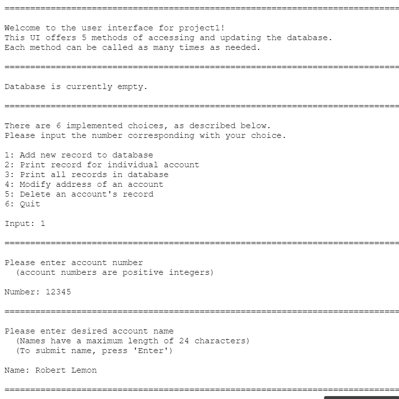

This project was meant to demonstrate a thorough understanding of C.  There was a heavy focus on pointers, as the database was stored in a self-implemented linked list.  The data was saved to a text file, and re-read into the program character by character.  This required specific character parsing, especially since the address input could span multiple lines.  Memory needed to be tracked and cleaned up after the program terminated, as well as organized in-terminal visuals.  There were allowed to be multiple accounts with the same account number, so this had to be taken into account when getting and setting account values.  Debugging features were also added, providing real-world experience for the software development process.  Since this was an independent project, a complete understanding of all topics was needed to successfully implement this project.

This is the section of the code that reads in user-inputted multi-line addresses:
```
    while ( (ch = getchar()) != '!' && length < size - 1 )
    {
        address[length++] = ch;

        if ( ch == '\n' )
        {
            printf("         ");
        }
    }

    address[length++] = '\0';
```
